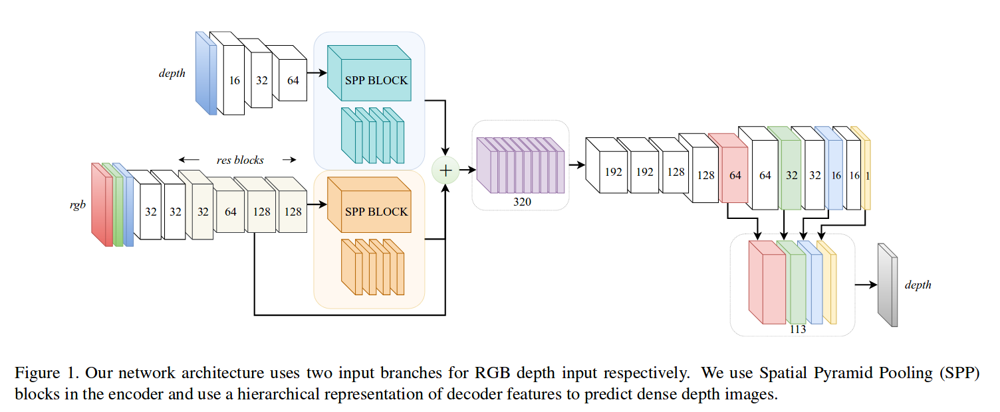
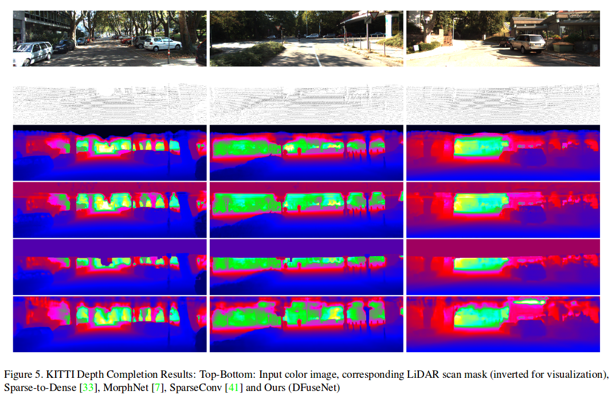
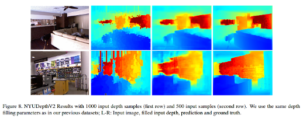
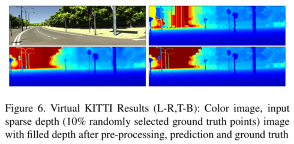
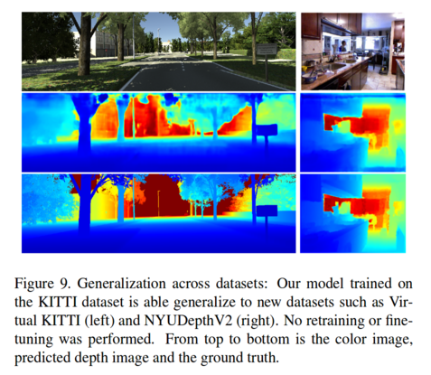

# DFuseNet

This is the accompanying code repository for our paper *"DFuseNet: Deep Fusion
of RGB and Sparse Depth Information for Image Guided Dense Depth Completion"*

ARXIV: https://arxiv.org/pdf/1902.00761.pdf





### Reference

If you use this work, please cite our paper:
```
@article{shivakumar2018deepfuse,
  title={DFuseNet: Deep Fusion of RGB and Sparse Depth Information for Image Guided Dense Depth Completion},
  author={Shivakumar, Shreyas S and Nguyen, Ty and Chen, Steven W. and Taylor, Camillo J},
  journal={https://arxiv.org/pdf/1902.00761.pdf},
  year={2019}
}
```

### Dependencies

We have docker images with all the necessary libraries installed. If this is of help to you, feel free to raise an issue / request and we will provide this image. However, it is possible that it is equally simple to install the necessary libraries yourself, and we have tested our code with the following versions:

1. [Python3.X](https://www.python.org/downloads/release/python-360/) *(We have tested Python 3.5 and Python 3.6)*
2. [CUDA 9.0](https://developer.nvidia.com/cuda-90-download-archive) and [CuDNN 5.1](https://developer.nvidia.com/cudnn)
3. [PyTorch](https://github.com/pytorch/pytorch) *(We have tested 0.4.X)*
```
pip install pytorch
```
4. [Torch Vision](https://github.com/pytorch/vision) *(We have tested 0.2.X)*
```
pip install torchvision
```
5. [PIL](https://pillow.readthedocs.io/en/5.3.x/) (Python Imaging Library)
```
pip install Pillow
```
6. [OpenCV 3.3.X](https://opencv.org/opencv-3-3.html) (optional)

### Testing the Network

To test our model on the KITTI validation dataset, please first download our
pretrained model (which we submitted to the KITTI Depth Completion Benchmark):

1. Navigate into the DFuseNet code repository and download our pretrained model
   into the following folder:
```
mkdir pretrained_weights
cd pretrained_weights/
wget https://www.dropbox.com/s/a4obmo6prdz8t1e/best_model.pth.tar
```

2. Once you have the pretrained weights in the correct folder, you can run the
   *validate_dfusenet.py* script on the KITTI Depth Completion
   *val_selection_cropped* sample set:
```
python3 validate_dfusenet.py --rgbin ABC/val_selection_cropped/image \
                             --din ABC/val_selection_cropped/velodyne_raw \
                             --dout XYZ/dfusenet_predictions/ \
                             --gpuid 0
```
This script will read two directories of images, one for RGB images and one for
depth scan images in the KITTI format (scaled by 256.0), perform inference using
the pretrained weights and save the predicted images in the KITTI format to a
folder *dfusenet_predictions* in a path specified by you.

3. We have included the KITTI Depth Completion and Prediction developer kit
   provided by KITTI so that you can easily verify the results.

```
cd kitti_dc_devkit/cpp
./make.sh
```

```
./evaluate_depth ABC/val_selection_cropped/groundtruth_depth XYZ/dfusenet_predictions
```

4. The provided evaluation script will generate evaluation statistics similar to
   this:

```
Done. Your evaluation results are:
mean mae: 0.429193
mean rmse: 1.2404
mean inverse mae: 0.00180893
mean inverse rmse: 0.00378059
mean log mae: 0.0222688
mean log rmse: 0.0451639
mean scale invariant log: 0.0449502
mean abs relative: 0.0226224
mean squared relative: 0.0035435
```

5. You will also see a folder of generated error maps as well as colormapped depth predictions such as this:


### Training the Network

Coming soon..


### Paper Media

1. Qualitative comparisons to other SOTA methods in depth completion (KITTI):



2. Results on NYUDepthV2:



3. Results on Virtual KITTI:



4. Generalization: Trained on KITTI, tested on Virtual KITTI and NYUDepthV2:


